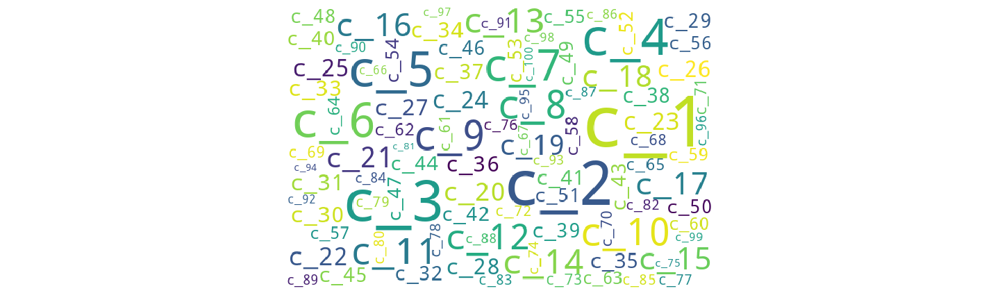

## Introduction

Recommender System is one of the growing demands in the current situation where the amount of information available on the internet is humongous. Recommender Systems can be useful for enterprises and directly for the users so as to decide what is best for them. The recommendation will be based on the past preferences and experiences so as to increase the probability of recommending right things. Recommender systems can recommend items based on the available information, for example, recommending restaurants based on the past dining out options or the available restaurant around a given location. It helps the enterprises (here restaurant owners) as the recommendation system could become an additional source which brings more business. 

## Objective
These recommendations can be extended to books, movies, organised profitable events (like conferences or music festivals) or non-profitable events (such as run for charity or fund raising activities). Recommending these events to the user based on their past experiences and preferences is one of the basic motivations to develop an event recommendation system. This recommendation takes into account varied amounts of information about the users and the events. Information related to the user includes age, gender etc. For events, the information includes the description, type, past attendees, location of the event etc. Apart from this, the system needs some information which relates users to events, like distance between the location user and event, or information if any user’s friends are visiting/organising the event. 	

This project tries to recommend whether the user would be interested in the given events (with details about type, location) based on the information available about the users, events and user's friends. 

We have used the dataset available on the Kaggle website [1:https://www.kaggle.com/c/event-recommendation-engine-challenge] and the competition was opened 7 years ago hence there are variety of solutions available for this dataset. 

## Data

The data available on the Kaggle website had huge dataset available. However, the data was not perfect that is it had mising values for several fields. Image below shows the missing values in the location field for users.csv available.
-given data csv files

 Similarly, the dataset available for events had missing values for various fields as shown in the below image. 

- explain given data, visualize

## Approach

Formalizing our problem as recommendation modelling and using techniques like collaborative filtering might not be a good idea for the following reasons. 
- For user/event based collaborative filtering model to be useful, there must be considerable overlapping of transactions between events and users which is not true in our case. The transactions data provided is too sparse for collaborating filtering to make useful recommendations. 
- Also, there are users and events that don't have an entry in the training data. 
- Another reason is that recommendations by collaborative filtering are generally generated from the open list of all events whereas the challenge requires us to generate recommendations for a user from the provided closed list of events.
- Custom features derived from the provided features of users and events may best determine the similarity between user and event and generate meaningful recommendations.

For the above reasons, we model this problem as a binary classification problem in which given a pair of user and event, we classify whether the user is interested in attending the event. Overall, the recommendation system can be divided into three phases- feature extraction, interest prediction and generation of recommendations. 

<!--The approach is to first extract features related to user, features related to event and custom features that measure the similarity between user and event based on the attedance history available. Then, use these features to learn supervised model that predicts if a user is interested in an event given.  -->

### Feature Extraction

In this phase, we perform feature engineering to identify and extract features that drive the prediction of user's interest in an event.  For a user and event pair, following are the features extracted. 
1. \[ number/ratio of users attending, not attending, maybe attending and invited to the event \]
  
2.  \[location similarity between user and event \]

3. \[time to event, apparently most important feature; \]
As we were mentioning before, one major drawback with event based recommendations is the time sensitivity of it. A user can only attend an event that is scheduled after reasonable amount of time and he/she cannot do anything about the past events or events that are starting very soon. Intuitively, the time difference between when the event is scheduled to start and when the user first came to know about it (in our case, time at which the user saw a notification about the event) is represented in this feature.

4. \[similarity between user and event based on attendance \]

5. Similarity between the user and the event based on cluster of words

6. Boolean indicating whether the user was invited to the event.
7. Boolean indicating whether the event was created by the user's friend. 
8. Gender of the user.
9. Age of the user determined based on the provided date of birth.

### Interest Prediction

### Generation of Recommendations
To generate recommendations for a user, we consider every event from the given closed list and predict if user is interested in it. The list of events that the system classifies as interested are then recommended to the user.

##  Experiments & Results

- list all models 

| Model | Accuracy  | Fbeta Score  |
| :---:   | :-: | :-: |
| Gaussian Naive Bayes | 0.7204545454545455 | 0.2902155887230514 |
| Random Forest |  | |
| KNN | |  |
| Logistic Regression |  |  |

- metric disucssion
- baseline models
- results plots
- analysis

## Conclusion and Future Work
- major achievement?
- future work - recommend events

