## Introduction

The proliferation of the amount of data available in every sector has created an increasing demand for machine learning-based systems including recommender systems and they have become quite ubiquitous. Slight variations of recommender systems are currently in use across multiple industries. These systems are algorithms that are aimed at suggesting relevant items to users based on their past preferences and experiences. For example, the Youtube recommender suggesting videos to watch next, an e-commerce application suggesting new products that a customer might be interested to purchase. In this project, we primarily focus on Event recommendation systems which recommend relevant events that the users might be interested to attend. Traditionally, Event based recommender systems need different algorithms [1] compared to an item recommender that recommends books or movies. We explore as to what techniques work best for event recommendations.

## Dataset

We initially started with the idea to use events and volunteer data from [Atlanta Habitat](http://www.atlantahabitat.org/), a non-profit organization. But, some unexpected delays in obtaining the data made us fall back on a publicly available dataset. The [Kaggle Events Dataset](https://www.kaggle.com/c/event-recommendation-engine-challenge) that we used is from an events related anonymous application that hosted a public contest a few years ago. The data is varied and spread across different files giving us the chance to pick up custom features and build on top of them. Here is a summary of the dataset components that we used:

1. **Events**: This file contains information about 3137972 events with the columns: event id, event creator id, event start time and event location details such as city, state, country, zip, latitude, longitude. Along with these, the top 100 most frequently occurring words from all the event names and descriptions are determined and their frequency is provided for each of the events. In other words, a bag of words of size 100 is provided for each event as a representative of the event's name and description. Figure 2 shows the frequency distribution of the top 50 words across all the events. We can notice the missing location data in figure 1 below.

   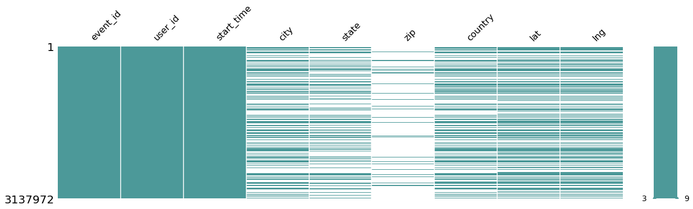
    

    <i>Figure 1: Missing values in events data</i>
   

   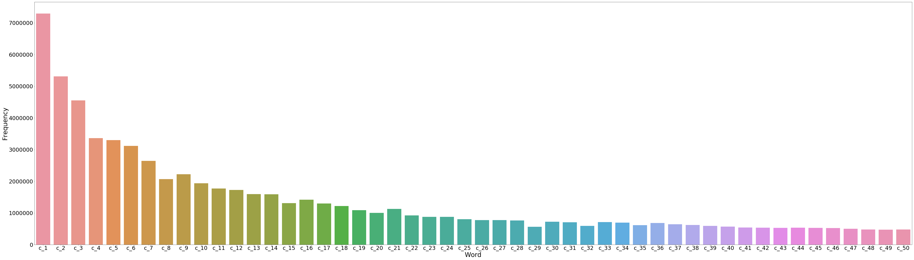
    

    <i>Figure 2: Frequency distribution of top 50 words across events' descriptions</i>
   
  
   

   
 

   

 
2. **Users**:  Here, we have data about 38209 users in the form of their ids, user locale, birthyear, gender, timestamp at which user joined, location and timezone. Notice the missing location data in the figure below.

   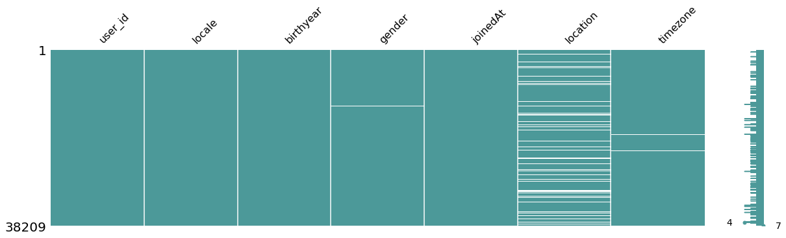
   

    <i>Figure 3: Missing values in users data</i>
   
  
   

   
 

   

  
3. **User friends**: This contains information in the form of a user id and the corresponding list of friend ids who are friends of the user. This social data is provided for only 38202 users. Figure 4 gives a picture of the distribution of the number of friends among the users from training data. Notice that among 38202 users, around one third have less than 250 friends and almost two-thirds of them have more than 250 friends indicating that the friends might not be based on interests and arbitrary.

   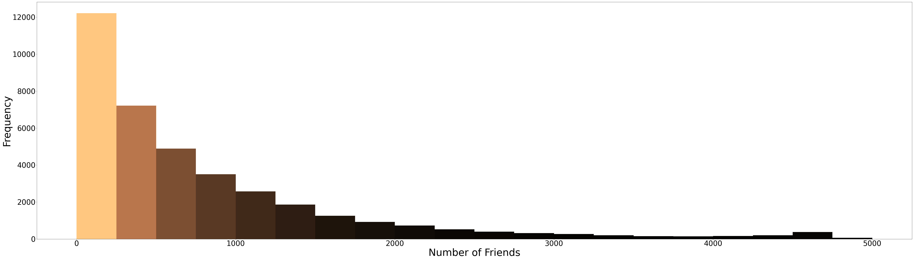
   

    <i>Figure 4: Distribution of number of friends among given users </i>
   

   

   
 

   

   
4. **Event attendees**:  For some of the events provided in the Events file(24144 events to be precise), this file contains four user id lists. For every event id, 
      - "yes" is the list of users who indicated that they were going to the event.
      - "maybe" is the list of users who indicated that they maybe going to the event.
      - "no" is the list of users who indicated that they were not going to the event.
      - "invited" is the list of users who were invited to the event.  
   

   
 

   

5. **User-Event interests**: For 15398 event-user pairs, we have information on whether this user was invited to the event, the timestamp at which this user saw the notification for this event and also two boolean values indicating whether this user indicated "interested" or "not interested" for the event.

## Approach

Traditional recommender system algorithms such as collaborative filtering would not work well for event recommendations [1]. The following reasons explain some of the reasoning behind not formalizing our problem as recommendation modelling.

- **Sparse collaborative information:** For user/event based collaborative filtering model to be useful, there must be considerable overlapping of transactions between events and users which is not true in our case. The transactions data provided is too sparse for collaborating filtering to make useful recommendations. 
- **New item problem:** Fundamentally, an event is very different from a book or movie consumption as there would be no consumption before the event occurs and it cannot be reused. It could be a similar kind of event but some of it's features such as start time and attendance list would be different. 
- **Limited training data:** In our case specifically, there are users and events that don't have an entry in the training data. 
- **Available custom features**: Custom features derived from the provided features of users and events may best determine the similarity between user and event and generate meaningful recommendations.

For the above reasons, we model this problem as a binary classification problem in which given a pair of user and event, we classify whether the user is interested in attending the event. Overall, the recommendation system can be divided into three phases- feature extraction, interest prediction and generation of recommendations. We had to spend most of our time on feature extraction in this experiment.

<!--The approach is to first extract features related to user, features related to event and custom features that measure the similarity between user and event based on the attedance history available. Then, use these features to learn supervised model that predicts if a user is interested in an event given.  -->

### 1. Feature Extraction

  In this phase, we perform feature engineering to identify and extract features that drive the prediction of user's interest in an event.  First, we handle the missing values by imputing the missing numbers with zeros and by imputing other missing values with forward fill followed by backward fill. For a user and event pair provided in the user-event interests file, following are the features extracted. 

1. ***Event attendance based metrics***

   There is a higher chance of our target user attending an event that is already popular. To measure the popularity of an event, we extract the following metrics based on user attendance and set up various features using these.   
      1. Number of users who marked "attending" for our event (f0)
      2. Number of users who marked "not attending" for our event (f1)
      3. Number of users who marked "may be attending" for our event (f2)
      4. Number of users who were invited to the event (f3)
      5. Ratio of number of users not attending to the number of users attending (f4)
      6. Ratio of number of users who might be attending to be number of users attending (f5)
      7. Ratio of number of users invited to the number of users attending (f6)  
      
   

   
 

   

2. ***Friends' attendance based metrics***

   Building on top of the above feature, considering only the attendance of current user's friends might give us a more reliable measure of the current user's interest in the event. Hence, we extracted a similar set of features restricting ourselves to consider only the friends of the current user instead of all the users. The following features are extracted in this way. We also added the normalized versions (by the total number of friends) of some of these features as additional features. 
      1. Number of friends who marked "attending" for our event (f7) and normalized (f14)
      2. Number of friends who marked "not attending" for our event (f8) and normalized (f15)
      3. Number of friends who marked "may be attending" for our event (f9) and normalized (f16)
      4. Number of friends who were invited to the event (f10) and normalized (f17)
      5. Ratio of number of friends not attending to the number of friends attending (f11)
      6. Ratio of number of friends who might be attending to the number of friends attending (f12)
      7. Ratio of number of friends invited to the number of friends attending (f13) 
   

   
 

   

3. ***Local convenience***

   Users are more likely to attend an event that is happening nearby and one that is preferably in the same city. From the user and event details, we extract two boolean features. The first one indicates whether the user and the event are in the same city and the second one indicates whether they are in the same country. Figures 5 and 6 show all the city locations where the events are happening and where the users are located on a world map.
   
   

    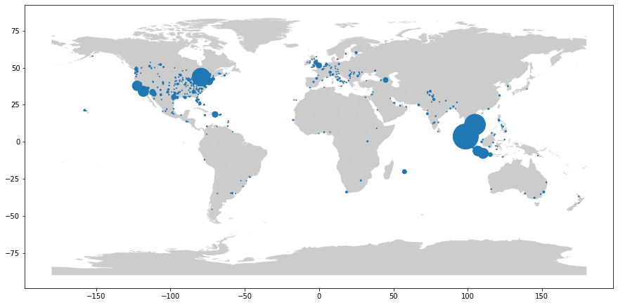
   

   

    <i>Figure 5: Event cities from training data scaled by number of events in a city</i>
   

   
   

   
 

   

   
   

    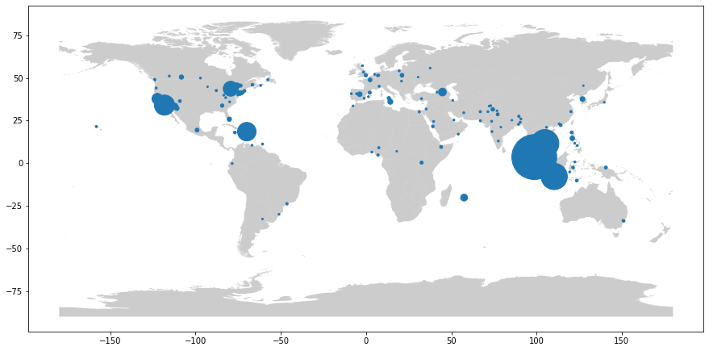
   

   

    <i>Figure 6: User city locations scaled by number of users in a city</i>
   
   

   
 

   

   
4. ***Schedule convenience***

   As we were mentioning before, one major drawback with event based recommendations is the time-sensitivity of it. A user can only attend an event that is scheduled after a reasonable amount of time and they cannot do anything about the past events or events that are going to start soon. Intuitively, the time difference between when the event is scheduled to start and when the user first came to know about it (in our case, time at which the user saw a notification about the event) is represented in this feature. Below figure shows the distribution of the time differences.

   

    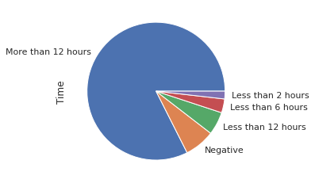
   

   

    <i>Figure 7: Time difference between event start time and user notification time</i>
   

   
   

   
 

   

5. ***Event similarity based on previously attended events***

   Analyzing the common attendees between two events might give us hints on how likely a user will attend the second event given that they attended the first event. The higher number of common attendees indicate higher similarity between the events and higher likeliness of users attending both the events. In this feature, we try to model this event similarity by determining the common attendees between our current target event and each of the events our current user has previously attended. For each such pair, we normalize the number of intersecting users by dividing with the number of attendees of the event with a lower number of attendees. The average of all such pairs is considered as our similarity score.  
   
  
  
6. ***Sometimes, people just prefer the familiar***
   
   If a user is interested in events related to a topic, they may also attend future events related to this topic. We can capture this feature by measuring the similarity between the event in question and the events that the user attended in the past. For every event, we are also provided with a bag of top 100 frequent words constructed from its name and description. We use this bag of words features to cluster together the events. To perform the unsupervised clustering, we use K-Means algorithm. Figure 8 shows the elbow curve that is used to determine the optimal number of clusters. However, the elbow is not obvious from the plot. As the total number of events is extremely high (3 million), we chose 200 clusters which is a trade-off between computation time and loss (sum of squared distances).

   <!-- 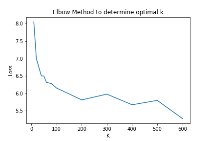 -->

   

    

   
<i>Figure 8: K Means Elbow Plot </i> 

   To visualize the clusters, we reduced the dimensions from 100 to 3 using PCA. Below is an interactive visualization of the first three principal components of events and their clusters.  

   <iframe id="igraph" scrolling="no" style="border:none;" seamless="seamless" src="https://pruthviperumalla.github.io/Event-Recommender-System/cluster.html" height="525" width="100%"></iframe>
   
   Using these clusters, we extract four similarity features one for each of the different interactions user had with the past events. i.e. For the first feature, we measure the similarity between the current event and the events for which user indicated that they were going. The second feature captures the similarity between the event in question to the events which user indicated that they may be going. Third, the similarity is measured between the current event and the events for which the user indicated that they were not going. The fourth feature captures the similarity between the current event and the events to which the user was invited. To measure the similarity between an event e and a list of events, we take the average of the euclidean distance between the centroid of the cluster e belongs to and the centroids of the clusters of events from the list. 
   
7. ***Sometimes, people just like what their friends like***

   Users may also attend events whose topics are similar to those that their friends attended. We capture three more features similar to the above features. Specifically, we extract similarity between the current event and the events that user's friends indicated that they were going, maybe going and not going as three different features. 
   
8. ***Sometimes, people just prefer the events they were invited to*** 

   This is a boolean feature indicating whether the user was invited to the event.

9. ***Sometimes, people just prefer the events created by their friends***
   
   This is a boolean feature indicating whether the event was created by the user's friend. 

10. ***Some events may be gender specific***
   
      We capture the gender of the user that may be a determining factor for events that are either gender-specific or gender-related.

11. ***Age influences social goals*** 
      
      Age may be an important feature considering that the social goals of humans vary with age. We extract this feature from the year of birth provided for the user.
      
#### Feature Correlations

We also attempted looking at the correlation between the various features that we extracted. As expected, features such as “same_city” and “same_country”, ratio based features that are built on the same metrics such as f7,f8,f9 and cluster-based similarity features are highly correlated. Apart from these features that are correlated because of the method used for their extraction, the “invited” and “yes” features also seem highly correlated. Intuitively, as more number of invitations are sent for an event, a higher number of "yes" responses are expected. Below is the heatmap for the correlation between the features. 
      
   

   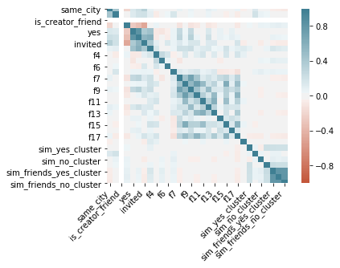 

   
<i>Figure 9: Feature Correlation Matrix</i> 

       

### 2. Interest Prediction
In this phase, we use the above extracted features to learn a classifier that predicts if a user is interested in a given event. We experimented with several supervised binary classification models with interested and not interested as the classes. Experiments performed with each of these models and results obtained are discussed in detail in the next section.

### 3. Generation of Recommendations
To generate recommendations for a user, we consider every event from the given closed list and predict if user is interested in it. The list of events that the system classifies as interested are then recommended to the user.

##  Experiments & Results
### Evaluation Metrics
The number of training samples available for each class is represented below. 

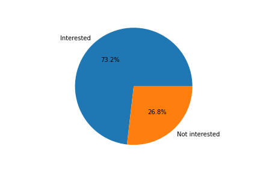 

<i>Figure 10: Class representation in training data</i> 

This shows that there is a class imbalance where the number of examples of the "not interested" class is almost three times the number of samples of the "interested" class. In such situations of class imbalance, a naive classifier that always predicts a "not interested" class would yield very high accuracies that would sometimes be greater than our trained model's accuracy.

Therefore, accuracy should not be the only metric to evaluate the results of various models and we should consider other baseline metrics such as F measure. In our current use case, we would use our class prediction to send out event invites to users who would potentially attend. As we do not intend to spam all the users, we would like the invites to be more precise and we have chosen F0.5 measure specifically as it gives more importance to precision than recall. F0.5 score is given by the following formula.

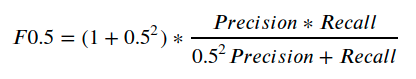 

### Baseline strategy

1. **Accuracy:** For accuracy, the baseline strategy would be to always predict the most frequent class as that would yield the highest possible accuracy.

2. **F0.5 score:** Precision and recall always counter balance each other. Always predicting the minority class ("not interested" in our case) would give a good lower bound for F0.5 score [2]. 

### Model results and analysis

Our train test split is 80:20. To avoid overfitting and to tune the hyperparameters, we used 5-folds cross-validation on the training split. Below, we discuss the experiments, results and analysis of the various models we trained in the interest prediction phase.

- **Random Forest**

   After tuning hyperparameters using k folds cross-validation, we got the best results for an ensemble of 100 trees with depth limited to 15, Gini impurity as the criterion to split, and with bootstrapping of the total number of data points drawn as samples and the square root of the total number of features considered for the construction of a tree. The relative feature importances determined by the Random Forest model are shown in figure 10.

   

   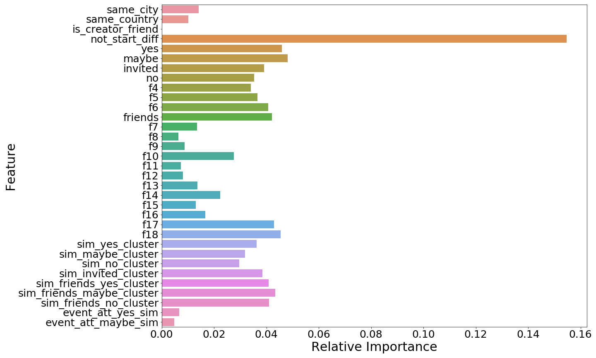 

   
 <i> Figure 10: Relative Feature Importances </i> 

   As seen from the figure above, time to event is the most important feature that determines whether a user will be interested in attending an event or not. The performance of the Random Forest is the best out of all supervised classifiers we tried. 

- **K Nearest Neighbors**

   In this model, we used 20 nearest neighbors for classification where each point is weighted by the inverse of their distance. KNN also produced above baseline results.

- **Logistic Regression**

   In logistic regression, we first used a standard scaler to normalize all the features to remove the dominance of higher magnitude features such as "Schedule convenience". In the actual model, we used an l2 regularizer with a regularization strength of 1.0 to train. We also tried tuning the regularization strength hyperparameter but it was not affecting the validation accuracy significantly.

- **Neural Network**

   We used a simple fully connected multi-layer perceptron to train our network. To decide on the number of hidden layers and number of nodes in each layer, we experimented with various values and started with the intuitive rule that the number of nodes in a hidden layer should be between the number of input nodes (31, in our case) and the number of output nodes(2, in our case).
   
   | No. of nodes in each hidden layer | Accuracy  | Fbeta Score  |
   | 15 | 0.736038961038961  | 0.41358293426208087  |
   | 20, 10 | 0.7126623376623377  | 0.396498455200824  |
   | 25 | 0.7321428571428571  | 0.4554455445544554  |
   | 30 | 0.7243506493506493  | 0.4235211760588029  |

 

- **Support Vector Machine**

   For Support Vector Machine, we tuned the hyperparameter C which controls the regularization strength of the model. We found out the SVM gives the best performance when the regularization is set to around 2000. We also tried different kernels such as “Radial Basis Kernel”, “Linear Kernel” and “Polynomial Kernel” and the model performs above baseline and has the highest test accuracy when using “Radial Basis Kernel”.

- **Gaussian Naive Bayes**

   Peformance of Gaussian Naive Bayes model is below the baseline model in terms of F0.5 score. The naive assumption that the every pair of features is conditionally independent may not hold in our case. Also, Naive Bayes gives equal importance to all the fields and does not discrimate betweeen the features. These may be reasons for its low performance.

- **Ensemble Classifier**

   To further improve the performance, we experimented with an ensemble of several of the above models we implemented. We obtained the best validation as well as the test results with an ensemble of Random Forest classifier and KNN classifer. These two classifiers are ensembled by the hard(majority) voting mechanism with 0.9 weight for Random Forest and 0.1 weight for KNN. In terms of F0.5 score, the ensemble model shows 2.6% improvement over the Random Forest classifier and 4.8% improvement over the KNN classifier.

Here is a comparison of test accuracy and test fbeta scores on various models that we trained.

   <table align="center">
     <tr>
       <th>Model</th>
       <th>Accuracy</th>
       <th>Fbeta (0.5) score</th>
     </tr>
     <tr>
       <td>Baseline</td>
       <td>0.731718</td>
       <td>0.31416400425985086</td>
     </tr>
     <tr>
       <td>Gaussian Naive Bayes</td>
       <td>0.7230519480519481</td>
       <td>0.27206771463119706</td>
     </tr>
     <tr>
       <td>Random Forest</td>
       <td>0.775974025974026</td>
       <td>0.5416272469252602</td>
     </tr>
     <tr>
       <td>KNN</td>
       <td>0.7665584415584416</td>
       <td>0.5161854768153981</td>
     </tr>
     <tr>
       <td>SVM</td>
       <td>0.6983766233766234</td>
       <td>0.3951277480689246</td>
     </tr>
     <tr>
       <td>Neural Net</td>
       <td>0.7321428571428571</td>
       <td>0.4554455445544554</td>
     </tr>
     <tr>
       <td>Logistic Regression</td>
       <td>0.7357142857142858</td>
       <td>0.18850987432675045</td>
     </tr>
     <tr>
       <td>Ensemble Learning</td>
       <td>0.7818181818181819</td>
       <td>0.5642923219241444</td>
     </tr>
   </table>

 

    

        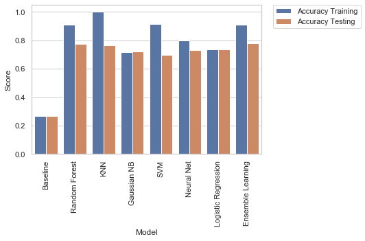
        
 <i> Figure: Accuracy plot </i> 

    

    

        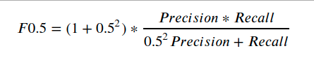
        
 <i> Figure: Fbeta plot </i> 

    

## Conclusion and Future Work

We took the approach of experimenting and comparing a few supervised models to determine which technique works best to predict what events users will be interested in based on events they've responded to in the past, user demographic information, and what events they've interacted with in the app. Our current results show above baseline performance (F0.5 score) for Random Forest, KNN, Neural Network and SVM with Random Forest performing the best out of all. Experiments also show that an ensemble model of Random Forest and KNN further improves the F0.5 score by 2.6%. We conclude that the hand-crafted custom features to measure similarity between user and event perform reasonably well on the task of user interest prediction even though the transactions between users and events are sparse.

As an extension to the project, we would like to rank the generated event recommendations based on the probability of user interest predicted by the models. Another extension would be to employ a new feature of user clustering by modeling friendships between users as a graph and detecting communities.

## References

1. [Event Recommendation in Event-based Social Networks](http://ceur-ws.org/Vol-1210/SP2014_02.pdf)
2. [What Is the Naive Classifier for Each Imbalanced Classification Metric?](https://machinelearningmastery.com/naive-classifiers-imbalanced-classification-metrics/)

