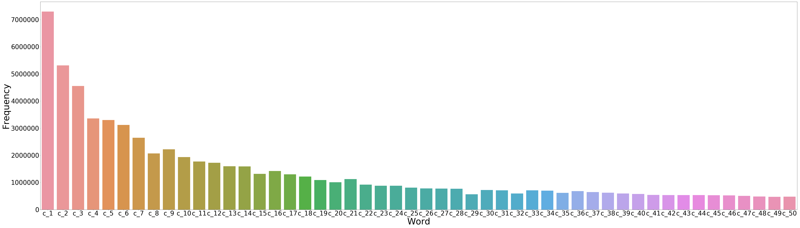
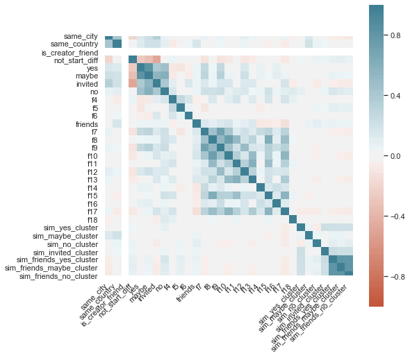
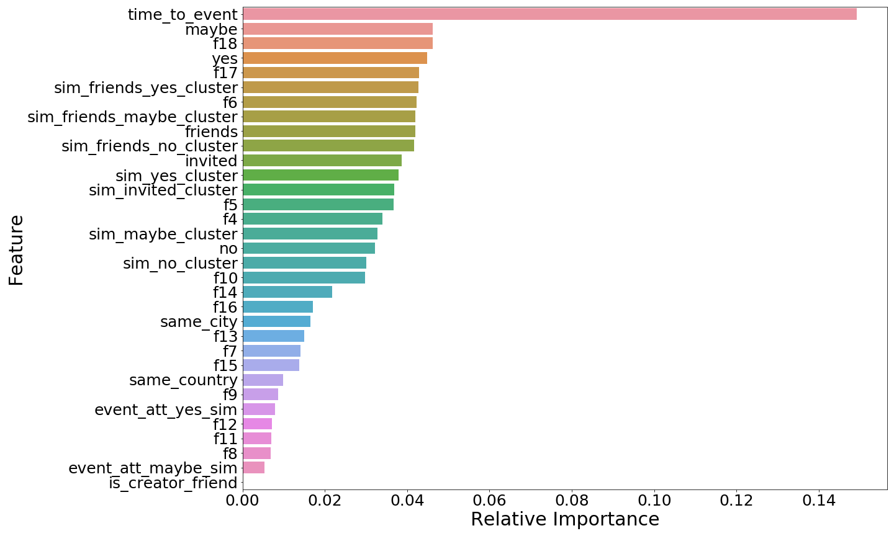

## Introduction

Recommender System is one of the growing demands in the current situation where the amount of information available on the internet is humongous. Recommender Systems can be useful for enterprises and directly for the users so as to decide what is best for them. The recommendation will be based on the past preferences and experiences so as to increase the probability of recommending right things. Recommender systems can recommend items based on the available information, for example, recommending restaurants based on the past dining out options or the available restaurant around a given location. It helps the enterprises (here restaurant owners) as the recommendation system could become an additional source which brings more business. 

## Objective
These recommendations can be extended to books, movies, organised profitable events (like conferences or music festivals) or non-profitable events (such as run for charity or fund raising activities). Recommending these events to the user based on their past experiences and preferences is one of the basic motivations to develop an event recommendation system. This recommendation takes into account varied amounts of information about the users and the events. Information related to the user includes age, gender etc. For events, the information includes the description, type, past attendees, location of the event etc. Apart from this, the system needs some information which relates users to events, like distance between the location user and event, or information if any user’s friends are visiting/organising the event. 	

This project tries to recommend whether the user would be interested in the given events (with details about type, location) based on the information available about the users, events and user's friends. 

We have used the dataset available on the Kaggle website [1:https://www.kaggle.com/c/event-recommendation-engine-challenge] and the competition was opened 7 years ago hence there are variety of solutions available for this dataset. 

## Data

The data available on the Kaggle website had huge dataset available. However, the data was not perfect that is it had missing values for several fields. Image below shows the missing values in the location field for users.csv available.

 Similarly, the dataset available for events had missing values for various fields as shown in the below image. 
 
 

- explain given data, visualize

*Fig. 2: Title*

- how missing values are handled

## Approach

Formalizing our problem as recommendation modeling and using techniques like collaborative filtering might not be a good idea for the following reasons. 
- For user/event based collaborative filtering model to be useful, there must be considerable overlapping of transactions between events and users which is not true in our case. The transactions data provided is too sparse for collaborating filtering to make useful recommendations. 
- Also, there are users and events that don't have an entry in the training data. 
- Another reason is that recommendations by collaborative filtering are generally generated from the open list of all events whereas the challenge requires us to generate recommendations for a user from the provided closed list of events.
- Custom features derived from the provided features of users and events may best determine the similarity between user and event and generate meaningful recommendations.

For the above reasons, we model this problem as a binary classification problem in which given a pair of user and event, we classify whether the user is interested in attending the event. Overall, the recommendation system can be divided into three phases- feature extraction, interest prediction and generation of recommendations. 

<!--The approach is to first extract features related to user, features related to event and custom features that measure the similarity between user and event based on the attedance history available. Then, use these features to learn supervised model that predicts if a user is interested in an event given.  -->

### 1. Feature Extraction

  In this phase, we perform feature engineering to identify and extract features that drive the prediction of user's interest in an event.  For a user and event pair, following are the features extracted. 

1. ***Event attendance based metrics***

   There is a higher chance of our target user attending an event that is already popular. To measure the popularity of an event, we extract the following metrics based on user attendance and set up various features using these. 
   
      - Number of users who marked "attending" for our event
      - Number of users who marked "no attending" for our event
      - Number of users who marked "may be" for our event
      - Number of users who are invited to the event
      - Ratio of number of users not attending with number of users attending
      - Ratio of number of users who might be attending with number of users attending
      - Ratio of number of users invited with number of users attending

2. ***Friend's attendance based metrics***

   Building on top of the first feature, looking at only the attendance of current user's friends might give us a stronger measure of current user's interests with that of the event. Hence, we extracted a similar set of features resitrcting ourselves to only look at the friends of current user instead of everyone. The following features are extracted in this way. 
   
      - Number of friends who marked "attending" for our event
      - Number of friends who marked "no attending" for our event
      - Number of friends who marked "may be" for our event
      - Number of friends who are invited to the event
      - Ratio of number of friends not attending with number of friends attending
      - Ratio of number of friends who might be attending with number of friends attending
      - Ratio of number of friends invited with number of friends attending

3. ***Local convenience***

   Users are more likely to attend an event that is happening nearby and one that is preferably in the same city. From the user and event details, we extract two boolean features. The first one checks if the user and event are in the same city and the second one checks if they are in the same country. For a better understanding we plotted the all the city locations where events are happening and where the user are located in a world map. 
   
   

    
   

   

    <i>Event cities from training data scaled by number of events in a city</i>
   

   
   

    
   

   

    <i>User city locations scaled by number of users in a city</i>
   

4. ***Schedule convenience***

   As we were mentioning before, one major drawback with event based recommendations is the time sensitivity of it. A user can only attend an event that is scheduled after reasonable amount of time and he/she cannot do anything about the past events or events that are starting very soon. Intuitively, the time difference between when the event is scheduled to start and when the user first came to know about it (in our case, time at which the user saw a notification about the event) is represented in this feature.

   

    
   

   

    <i>Time difference between event start time and user notification time</i>
   

5. \[similarity between user and event based on attendance \]

6. ***Sometimes, people just prefer the familiar***
   
   If a user is interested in events related to a topic, they may also attend future events related to this topic. We can capture this feature by measuring the similarity between the event in question to the events user attended in the past. For every event, we are also provided a bag of top 100 frequent words constructed from its name and description. We use this bag of words features to cluster together the events. To perform the unsupervised clustering, we use K-Means algorithm. Figure <> shows the elbow curve that is used to determine the optimal number of clusters. However, the elbow is not obvious from the plot. As the total number of events is extremely high (3 million), we chose 200 clusters which is a trade-off between computation time and loss (sum of squared distances).

   <!--  -->

   

    

   
<i>Figure 2: K Means Elbow Plot </i> 

   To visualize the clusters, we reduced the dimensions from 100 to 3 using PCA. Below is an interactive visualization of the first three principal components of events and their clusters.  

   <iframe id="igraph" scrolling="no" style="border:none;" seamless="seamless" src="https://pruthviperumalla.github.io/Event-Recommender-System/cluster.html" height="525" width="100%"></iframe>
   
   Using these clusters, we extract four similarity features one for each of the different interactions user had with the past events. i.e. For the first feature, we measure the similarity between the current event and the events for which user indicated that they were going. Second feature captures the similarity between the event in question to the events which user indicated that they maybe going. Third, similarity is measured between current event and the events for which user indicated that they were not going. Fourth feature captures the similarity between the current event and the events to user was invited. To measure the similarity between an event *e* and a list of events, we take the average of the euclidean distance  between the centroid of the cluster *e* belongs to and the centroids of the clusters of events from the list. 

7. ***Sometimes, people just like what their friends like***

   Users may also attend events whose topics are similar to those that their friends attended. We capture three more features similar to the above features. Specifically, we extract similarity between the current event and the events that user's friends indicated that they were going, maybe going and not going as three different features. 

8. ***Sometimes, people just prefer the events they were invited to*** 

   This is a boolean feature indicating whether the user was invited to the event.

9. ***Sometimes, people just prefer the events created by their friends***
   
   This is a boolean feature indicating whether the event was created by the user's friend. 

10. ***Some events may be gender specific***
   
      We capture the gender of the user that may be a determining factor for events that are either gender-specific or gender-related.

11. ***Age influences social goals*** 
      
      Age may be an important feature considering that the social goals of humans vary with age. We extract this feature from the year of birth provided for a user.
      
      Below is the heatmap for the correlation between the features. 
      
   

    

   
<i>Figure 3: Correlation Matrix</i> 

      
      

### 2. Interest Prediction
In this phase, we use the above extracted features to learn a classifier that predicts if a user is interested in a given event. We experimented with several supervised binary classification models with interested and not interested as the classes. Experiments performed with each of these models and results obtained are discussed in detail in the next section.

### 3. Generation of Recommendations
To generate recommendations for a user, we consider every event from the given closed list and predict if user is interested in it. The list of events that the system classifies as interested are then recommended to the user.

##  Experiments & Results

- metric definiton, why 
- baseline models, why

Our train test split is 80:20. To avoid overfitting and tune the hyperparameters, we used 5-folds cross validation on the training split. Below, we discuss the experiments, results and analysis of the various models we trained in the interest prediction phase. 

- **Random Forest**

   After tuning hyper parameters using k folds cross validation, we got the best results for an ensemble of 100 trees with depth limited to 15, gini impurity as the criterion to split, and with bootstrapping of the total number of data points drawn as samples and square root of the total number of features considered for the construction of a tree. The relative feature importances determined by the Random Forest model are shown in the figure <#>.

   

    

   
 <i> Figure 3: Relative Feature Importances </i> 

   As seen from the figure above, time to event is the most important feature that determines whether a user will be interested in attending an event or not. The peformance of the Random Forest is the best out of all supervised classifiers we tried. 

- **K Nearest Neighbors**

   In this model, we used 20 nearest neighbors for classification where each point is weighted by the inverse of their distance. KNN also produced above baseline results.

- **Logistic Regression**

- **Neural Network**

- **Support Vector Machine**

   For Support Vector Machine, we tuned the hyperparameter C which controls the regularization strength of the model. We found out the SVM gives the best performance when the regularization is set to around 2000. We also tried different kernels such as "Radial Basis Kernel", "Linear Kernel" and "Polynomial Kernel" and the model has the highest test accuracy when using "Radial Basis Kernel".

- **Gaussian Naive Bayes**

   Peformance of Gaussian Naive Bayes model is below the baseline model in terms of F0.5 score. The naive assumption that the every pair of features is conditionally independent may not hold in our case. Also, Naive Bayes gives equal importance to all the fields and does not discrimate betweeen the features. These may be reasons for its low performance.

- **Ensemble Classifier**

   To further improve the performance, we experimented with an ensemble of several of the above models we implemented. We obtained the best validation as well as the test results with an ensemble of Random Forest classifier and KNN classifer. These two classifiers are ensembled by the hard(majority) voting mechanism with 0.9 weight for Random Forest and 0.1 weight for KNN. In terms of F0.5 score, the ensemble model shows 2.6% improvement over the Random Forest classifier and 4.8% improvement over the KNN classifier.

- VALUES NEED TO BE UPDATED!

| Model | Accuracy  | Fbeta Score  |
| :---:   | :-: | :-: |
| Gaussian Naive Bayes | 0.7204545454545455 | 0.2902155887230514 |
| Random Forest | 0.7746753246753246 | 0.5323383084577115 |
| KNN | 0.7616883116883116 | 0.5085435313262815 |
| SVM | 0.699025974025974 | 0.3810930576070901 |
| Neural Net | 0.7327922077922078 | 0.4452296819787986 |
| Logistic Regression | 0.7334415584415584 | 0.17395182872435327 |
| El | 0.7772727272727272 | 0.5445304937076476 |
| Ensemble Learning | 0.775974025974026 | 0.5396902226524685 |

- results plots
- analysis

## Conclusion and Future Work

We took the approach of experimenting and comparing a few supervised models to determine which technique works best to predict what events users will be interested in based on events they've responded to in the past, user demographic information, and what events they've interacted with in the app. Our current results show above baseline performance (F0.5 score) for Random Forest, KNN, Neural Network and SVM with Random Forest performing the best out of all. Experiments also show that an ensemble model of Random Forest and KNN further improves the F0.5 score by 2.6%. We conclude that the hand-crafted custom features to measure similarity between user and event perform reasonably well on the task of user interest prediction even though the transactions between users and events are sparse.

As an extension to the project, we would like to rank the generated event recommendations based on the probability of user interest predicted by the models. Another extension would be to employ a new feature of user clustering by modeling friendships between users as a graph and detecting communities.

## References

